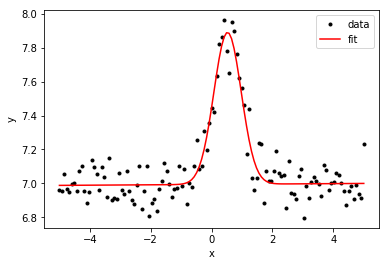

# peakfit

Wrapper around scipy _curve_fit_[^1] to fit peak shaped data

- include basic peak functions (Gauss, Lorentzian, PseudoVoigt)
- method to automate estimation of the initial parameters 
- allows to sum functions, for instance to fit double peak or peak with a background (see [test notebook](test_peakfit.ipynb))
- returns parameters in a dictionary
    * with meaningful key names
    * and standard deviation error estimated from the covariance matrix [^2]

[1] [_curve_fit_ documentation](https://docs.scipy.org/doc/scipy-1.5.1/reference/generated/scipy.optimize.curve_fit.html#scipy.optimize.curve_fit), non-linear least square, usually Levenberg-Marquardt algorithm

[2] _"sigma is scaled to match the sample variance of the residuals after the fit"_ (see curve_fit doc)

_note:_ uses Jupyter notebook, and [jupytext](https://jupytext.readthedocs.io/en/latest/index.html) to pair notebooks to _light Script_ py format

## Simple example

```python
import numpy as np
import matplotlib.pyplot as plt
from peakfit import *

# Generate random test data
x = np.linspace(-5, 5, 123)
y = 7 + 0.1*np.random.randn(*x.shape)
y += Gauss()(x, 0.5, 1, 1)

# Fit using automatic estimation of initial parameters
results, fit = peakfit(x, y, Gauss())

for r in results:
    print(r)

# Graph
plt.plot(x, y, '.k', label='data');
plt.plot(x, fit(x), 'r-', label='fit');
plt.xlabel('x'); plt.ylabel('y'); plt.legend();
```


```
{'function': 'Gaussian', 'x0': 0.5167421276191795, 'x0_std': 0.01582065500226034, 'fwhm': 0.9716960815678847, 'fwhm_std': 0.03889627759701725, 'amplitude': 1.0791532686178142, 'amplitude_std': 0.0362956738388946}
{'function': 'Linear', 'slope': -0.004135378131614483, 'slope_std': 0.002719507550131077, 'intercept': 7.010978784158914, 'intercept_std': 0.008891015216729381}
```




## Install

Copy the `peakfit.py` file in your project folder...

## Next
- allow for constraint optim: define bounds
- 95% confidence intervale instead of std.
- what about Poisson noise? if I>10 the effect is negligible
- package install
- standard graph for verification

## Also
- https://fityk.nieto.pl/