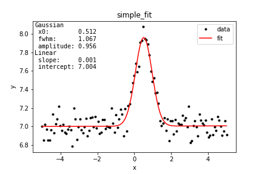

# peakfit

Wrapper around scipy _curve_fit_[^1] to fit peak shaped data

- include basic peak functions (Gauss, Lorentzian, PseudoVoigt)
- method to automate estimation of the initial parameters 
- allows to sum functions, for instance to fit double peak or peak with a background (see [test notebook](test_peakfit.ipynb))
- returns parameters in a dictionary
    * with meaningful key names
    * and standard deviation error estimated from the covariance matrix [^2]
- method to save summary graphs for rapid visual verification

[1] [_curve_fit_ documentation](https://docs.scipy.org/doc/scipy-1.5.1/reference/generated/scipy.optimize.curve_fit.html#scipy.optimize.curve_fit), non-linear least square, usually Levenberg-Marquardt algorithm  
[2] _"sigma is scaled to match the sample variance of the residuals after the fit"_ (see curve_fit doc)

_note:_ uses Jupyter notebook, and [jupytext](https://jupytext.readthedocs.io/en/latest/index.html) to pair notebooks to _light Script_ py format

## Simple example

```python
import numpy as np
import matplotlib.pyplot as plt
from peakfit import *

# Generate random test data
x = np.linspace(-5, 5, 123)
y = 7 + 0.1*np.random.randn(*x.shape)
y += Gauss()(x, 0.5, 1, 1)

# Fit using automatic estimation of initial parameters
results, fit = peakfit(x, y, Gauss())

for r in results:
    print(r)

# Graph
plot_results(x, y, results, fit,
             save_path='./example/',
             save_name='simple_fit');
```


```
{'function': 'Gaussian', 'x0': 0.5118165702655286, 'x0_std': 0.01919764032426884, 'fwhm': 1.0669309886475926, 'fwhm_std': 0.047420959053825144, 'amplitude': 0.9555028940163733, 'amplitude_std': 0.03555326587415687}
{'function': 'Linear', 'slope': 0.0006902393525260128, 'slope_std': 0.0027897680827435943, 'intercept': 7.0042950253252085, 'intercept_std': 0.009236314095164573}
```




⮕ See the [test_peakfit notebook](test_peakfit.ipynb) for more detailed usage

## Install

- Copy the `peakfit.py` file in your project folder...
- Needs Python 3, Numpy, Scipy and Matplotlib

## Next
- allows for constraint optim: define bounds
    - Baysian MAP, using prior
- allows for semi-automation approach
    - i.e. output a modifiable fitting script
- 95% confidence intervale instead of std.
- what about Poisson noise? if I>10 the effect is negligible
- package install

## Also
- [Fityk [fi:tik] is a program for data processing and nonlinear curve fitting.](https://fityk.nieto.pl/)
- [Bumps: data fitting and uncertainty estimation](https://github.com/bumps/bumps)
